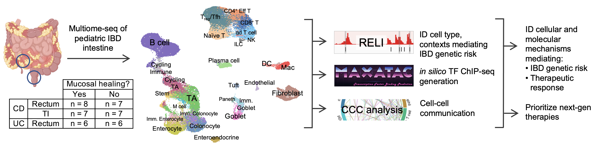

# Multiome-seq links inflammatory bowel disease polygenic risk to TNF inhibitor response

Codebases and analysis pipelines supporting the manuscript:

> **Multiome-seq links inflammatory bowel disease polygenic risk to TNF inhibitor response**  
> *Yang, Wayman, Denson, et al.* (2026)

Inflammatory Bowel Disease (IBD) is a chronic autoinflammatory disorder with rising incidence in pediatrics. TNFa inhibition (TNFi) is the first-line biologic therapy in children, but many do not achieve mucosal healing. Identifying which patients will benefit from TNFi and the underlying nonresponse mechanisms is critical. We built a novel resource: whole genome sequencing linked to multiome-seq (single-nuclei transcriptome and chromatin accessibility) of intestinal biopsies from a cohort of children with IBD, whose TNFi response was defined by mucosal healing. Our study uncovers links between IBD genetic risk and TNFi response. First, classifiers integrating genetic data with clinical variables identified the IBD polygenic risk score as a top predictor of TNFi response. Second, multiome-seq analysis implicated IBD risk variants in persistent cytokine signaling in monocytes, macrophage and fibroblasts of nonresponders. These data reveal genetic mechanisms of treatment response in pediatric IBD and suggest alternative therapeutic approaches for TNFi nonresponders.

---

## Clinical + PRS modeling
* Generation of IBD and colorectal cancer polygenic risk scores
* Firth logistic regression
* Random forest classifiers
* Model evaluation and replication cohort analyses

---

## Multiome Processing
* Quality control
* Doublet removal
* Integration
* Peak calling
* Bridge integration
* Cell type annotation

---

## [Differential Expression & Accessibility](./workflows/workflow_DE_DA.md)
* Differential gene expression analysis
* Differential chromatin accessibility analysis
* ImmDict/CytoSig/PROGENy signal-response analyses

---

## Genetic Risk Integration
* RELI GWAS enrichment analyses
* Enhancer-to-gene mapping
  * Activity-by-Contact (ABC)
  * eQTL Catalogue integration
  * Promoter proximity mapping
* Robustness analyses across mapping strategies

---

## Cell Subtype Analyses
* Macrophages subpopulation annotation
* Fibroblast subpopulation annotation

---

## Transcription Factor Networks
* maxATAC TF binding prediction
* TF motif enrichment
* chromVAR TF activity
* Regulatory network construction
* Regulatory network visualization

---

# Figures

Scripts used to generate:
- Main Figures 1-6
- Supplemental Figures S1-S10

Each figure directory contains the scripts required to reproduce the published panels.

---

# Data Availability

Raw and processed sequencing data have been deposited in GEO and will become publicly available upon publication.

| Dataset | GEO accession |
|----------|---------------|
| snRNA/snATAC Multiome | GSEXXXXXXXX |
| Whole-genome sequencing | dbGAP XXXXXXXX |

---

# Contact

Questions regarding the analyses or repository should be directed to the corresponding authors.
